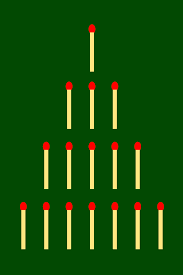

# Nim game

This repository contains a simple implementation of the [nim game](https://en.wikipedia.org/wiki/Nim).

Nim is a mathematical game of logic and strategy. The goal of Nim is to be the player who removes the last of ten sticks.
On each turn, a player must remove one or two sticks during their turn. The player who removes the last stick wins.

